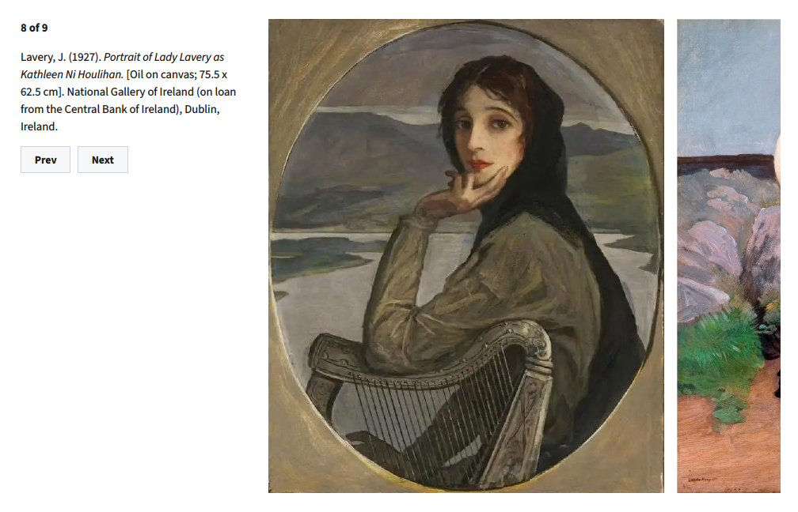

**Hugo Strip Gallery** is a Hugo shortcode for rendering a horizontal strip gallery with captions from structured image data.



## Usage

### Shortcode invocation

```hugo

[
    {
        "src": "image-path.jpg",
        "alt": "Accessible alternate text",
        "caption": "Image caption. *Markdown is supported.*"
    },
    {
        "src": "second-image-path.jpg",
        "alt": "Second image alt text",
        "caption": "Another caption."
    }
]

```

### Image data format

The image list is provided as a JSON-like array parsed by the shortcode; strict JSON validation is not required.

Each image object supports the following fields:

- `src` -- Image filename
- `alt` -- Alternate text [Optional]
- `caption` -- Caption text (Markdown supported) [Optional]

### File placement

All image files must reside within the same page bundle as the Markdown file invoking the shortcode.

### Optional parameters

An optional `height` attribute may be provided to constrain the rendered image height:

```hugo

```

